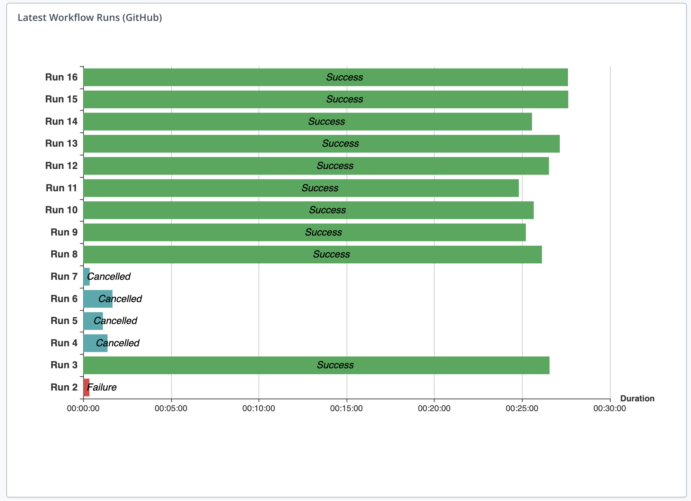

# GitHub Actions Integration for XL Release


[](https://opensource.org/licenses/MIT)
[](https://github.com/xebialabs-community/xlr-github-actions-plugin/releases)
[](https://github.com/RichardLitt/standard-readme)

## Installation

### Requirements

1. XL Release 9.0+

### Building the plugin
The gradle wrapper facilitates building the plugin.  Use the following command to build using [Gradle](https://gradle.org/):
```bash
./gradlew clean build
```
The built plugin, along with other files from the build, can then be found in the _build_ folder.

### Adding the plugin to XL Release

Download the latest version of the plugin from the [releases page](https://github.com/xebialabs-community/xlr-github-actions-plugin/releases).  The plugin can then be installed through the XL Release graphical interface or the server backend.  For additional detail, please refer to [the docs.xebialabs.com documentation on XLR plugin installation](https://docs.xebialabs.com/xl-release/how-to/install-or-remove-xl-release-plugins.html)

## Usage

__Available Tasks__: Check Workflow Run, Trigger Workflow Run

__Available Triggers__: None

__Available Dashboard Tiles__: Workflow Runs Timeline Tile

### Tasks

#### Check Workflow Run
Properties:
* Server _input_ 
* Owner _input_ 
* Repository _input_ 
* Workflow ID _input_ 
* Run Id Script _script_ 
* Workflow Run ID _output_ 

#### Trigger Workflow Run
Properties:
* Server _input_ 
* Owner _input_ 
* Repository _input_ 
* Workflow ID _input_ 
* Ref _input_ 
   * The reference of the workflow run. The reference can be a branch, tag, or a commit SHA.
* Inputs _input_ 
   * Comma-separated keys and values configured in the workflow file. The maximum number of properties is 10. Any default properties configured in the workflow file will be used when inputs are omitted.
* Triggered _script_ 
* Run Id Script _script_ 
* Workflow Run ID _output_ 

### Tiles

#### Workflow Runs Timeline Tile
Properties:
* Server _input_ 
* Title  
   * Tile title
* Owner _input_ 
* Repository _input_ 
* Workflow ID _input_ 
* Count _input_ 
   * The number of latest workflow runs to visualize



## Contributing

Please review the contributing guidelines for _xebialabs-community_ at [http://xebialabs-community.github.io/](http://xebialabs-community.github.io/)

## License

This community plugin is licensed under the [MIT license](https://opensource.org/licenses/MIT).

See license in [LICENSE.md](LICENSE.md)
